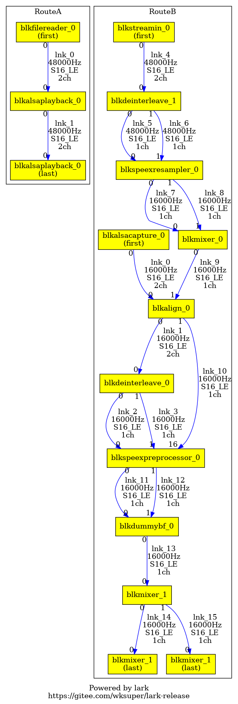

# lark

[English](https://gitee.com/wksuper/lark-release/blob/master/README.md) | [简体中文](https://gitee.com/wksuper/lark-release/blob/master/README-cn.md)

***lark***是一个轻量级但功能强大的软件音频DSP。它提供了一种灵活可扩展的方法来设计高性能、低MCPS、低延时的音频路由，让您可以像搭积木一样构建音频系统。
主要特性（至v0.8版本）：

- 支持实时操作音频路由
  - 实时加载/卸载块
  - 实时改变路径
  - 实时调节块参数
- 支持预编译的输入/输出块
  - file-reader, file-writer, stream-in, stream-out, alsa-capture, alsa-playback, tinyalsa-capture, tinyalsa-playback, portaudio-capture, portaudio-playback
- 支持预编译的算法块
  - gain, mixer(duplicator), multiplexer, interleave, de-interleave, format-adapter, delay, align, buffer, speex-resampler, speex-preprocessor, soundtouch, sox-effect
- 支持无限客制化块
- 支持每块最多32个输入端点，32个输出端点
- 支持基于帧的时间戳和基于采样点的时间戳
- 支持实时调试工具
  - 打印状态
  - 打印路由快照到文件
  - 实时设定日志等级
  - 转储日志到文件
  - 转储各个块的音频数据到文件
- 支持多操作系统
  - Linux (x86_64), MacOS (x86_64)

## 开始

***lark***是由一个基础的动态库`liblark.so`，各种可选的块（动态加载库）例如`libblkmixer.so`，和一个可选的可执行调试工具`lkdb`组成。基于 ***lark***，您可以很容易地创建您想实现的既可以简单又可以复杂的音频路由，实时启动/停止任意一个路由，或者实时设定/获取任意块的参数。

### 第1步

由于 ***lark*** 依赖于klogging库，您首先需要安装klogging。访问 <https://gitee.com/wksuper/klogging> 以安装之。另一种方式是，此仓库已经包含了预编译好的`libklogging.so`，它会随着lark的安装而一起安装。

### 第2步

安装 ***lark*** 到您的Linux机器。

```bash
$ cd lark-release
$ sudo ./install.sh
$ sudo ldconfig
```

当您不需要 ***lark*** 时，您可以使用`sudo ./uninstall.sh`来移除它。

### 第3步

运行音频路由。

#### 例1：运行一个单路由，做立体声音乐文件播放

```
RouteA

  libblkfilereader.so     libblkalsaplayback.so
  *******************      ******************
  *                 *      *                *
  *  filereader_0   *0--->0* alsaplayback_0 *
  *                 *      *                *
  *******************      ******************
```

```bash
$ x86_64-linux-gnu/bin/larkexample1
```

如果没错误的话，音乐文件应该开始播放了。

这个例子的源代码在此：[larkexample1.cpp](https://gitee.com/wksuper/lark-release/blob/master/examples/larkexample1.cpp)。

#### 例2：运行一个单路由，把两个音乐文件输入做带各自增益的混合播放

```
RouteA

 libblkfilereader.so   libblkdeinterleave.so   libblkgain.so           libblkmixer.so       libblkinterleave.so     libblkalsaplayback.so

  *****************     ******************     *************           **************       *******************      ******************
  *               *     *                *0-->0*           *0-------->0*            *0---->0*                 *      *                *
  * filereader_0  *0-->0* deinterleave_0 *1-->1*   gain_0  *1---+      *   mixer_0  *       *   interleave_0  *0--->0* alsaplayback_0 *
  *               *     *                *     *           *    | +-->1*            *   +->1*                 *      *                *
  *****************     ******************     *************    | |    **************   |   *******************      ******************
                                                                | |                     |
  *****************     ******************     *************    | |    **************   |
  *               *     *                *     *           *    +-|-->0*            *0--+
  * filereader_1  *0-->0* deinterleave_0 *0-->0*   gain_1  *0-----+    *   mixer_1  *
  *               *     *                *1-->1*           *1-------->1*            *
  *****************     ******************     *************           **************
```

```bash
$ x86_64-linux-gnu/bin/larkexample2
```

如果没错误的话，两个音乐文件应该开始混合播放输出了。

这个例子的源代码在此：[larkexample2.cpp](https://gitee.com/wksuper/lark-release/blob/master/examples/larkexample2.cpp)。

#### 例3：运行双路由，一个做音乐播放，一个采集麦克风以做关键词侦测

```
                                                                                                     ****************      ******************      ***************
                                                                                        RouteA       *              *      *                *      *             *
                                                                                                     * filereader_0 *0--->0* alsaplayback_0 *0--->0* streamout_0 *
                                                                                                     *              *      *                *      *             *
                                                                                                     ****************      ******************      ********|******
                                                                                                                                                           v
========================================================================================================================================================[FIFO]=====
                                                                                                                                                         |
  **************     **************     *************     ***********************     ******************     ***********     *****************      *****v********
  *            *     *            *     *           *     *                     *     *                *     *         *     *               *      *            *
  * dummykwd_0 *0<--0*            *     *           *     *                     *0<--0* deinterleave_0 *0<--0*         *0<--0* alsacapture_0 *      * streamin_0 *
  *            *     *            *     *           *     *                     *1<--1*                *     *         *     *               *      *            *
  **************     *            *     *           *     *                     *     ******************     *         *     *****************      ******0*******
                     *            *     *           *     *                     *                            *         *                                  v
                     *  mixer_1   *0<--0* dummybf_0 *0<--0* speexpreprocessor_0 *                            * align_0 *                        **********0*******
                     *(duplicator)*     *           *1<--1* (aec, denoise, ...) *                            *         *          RouteB        * deinterleave_1 *
                     *            *     *           *     *                     *                            *         *                        ********0**1******
                     *            *     *           *     *                     *                            *         *                                v  v
****************     *            *     *           *     *                     *                            *         *     ***********      **********0**1******
*              *     *            *     *           *     *                     *16<------------------------1*         *     *         *0<---0*                  *
* filewriter_0 *0<--1*            *     *           *     *                     *                            *         *1<--0* mixer_0 *1<---1* speexresampler_0 *
*              *     *            *     *           *     *                     *                            *         *     *         *      *                  *
****************     **************     *************     ***********************                            ***********     ***********      ********************
```

运行例3之前，需要先安装speex库。

```bash
$ sudo apt install libspeexdsp-dev
```

运行例3：

```bash
# 两个参数指的是alsa playback pcm name和capture pcm name。
# 它们随着机器的不同而不同。
$ x86_64-linux-gnu/bin/larkexample3 plughw:0,0 plughw:0,0
```

如果没错误的话，播放和录音应该同时开始了。
录到的声音文件存放在`./cap-16000_16_1.pcm`。

这个例子的源代码在此：[larkexample3.cpp](https://gitee.com/wksuper/lark-release/blob/master/examples/larkexample3.cpp)。

#### 例5：运行一个单播放路由，嵌入了SoundTouch以做音调、节拍、播放速率的调节

```
RouteA

 libblkfilereader.so   libblkformatdapter.so    libblksoundtouch.so   libblkpaplayback.so
  ****************      *******************      ****************      ****************
  *              *      *                 *      *              *      *              *
  * filereader_0 *0--->0* formatadapter_0 *0--->0* soundtouch_0 *0--->0* paplayback_0 *
  *              *      *                 *      *              *      *              *
  ****************      *******************      ****************      ****************
```

运行例5之前需要先安装 ***SoundTouch*** 库和 ***PortAudio*** 库。

```bash
$ sudo apt install libsoundtouch-dev
$ sudo apt install libportaudio2
```

运行例5：

```bash
$ x86_64-linux-gnu/bin/larkexample5
```

如果没错误的话，播放应该开始了。

在另一个shell里，

```bash
$ lkdb status                                   # 显示lark状态

$ lkdb setparam RouteA blksoundtouch_0 1 0.6    # 音调变低
$ lkdb setparam RouteA blksoundtouch_0 1 1.8    # 音调变高
$ lkdb setparam RouteA blksoundtouch_0 1 1.0    # 音调变正常
$ lkdb setparam RouteA blksoundtouch_0 2 0.5    # 节拍变慢
$ lkdb setparam RouteA blksoundtouch_0 2 2.0    # 节拍变块
$ lkdb setparam RouteA blksoundtouch_0 2 1.0    # 节拍变正常
$ lkdb setparam RouteA blksoundtouch_0 3 2.2    # 播放速率变快
$ lkdb setparam RouteA blksoundtouch_0 3 0.4    # 播放速率变慢
$ lkdb setparam RouteA blksoundtouch_0 3 1.0    # 播放速率变正常
```

这个例子的源代码在此：[larkexample5.cpp](https://gitee.com/wksuper/lark-release/blob/master/examples/larkexample5.cpp)。


#### 例7：运行一个带SoX效果器的单播放路由

```
RouteA

 libblkfilereader.so  libblkformatdapter.so   libblkdeinterleave.so  libblkmixer.so  libblksoxeffect.so  libblkinterleave.so  libblkpaplayback.so

  ****************     *******************     ******************     ***********     ***************     ****************     ****************
  *              *     *                 *     *                *     *         *     * soxeffect_0 *     *              *     *              *
  *              *     *                 *     *                *0-->0*         *0-->0* (highpass)  *0-->0*              *     *              *
  *              *     *                 *     *                *     *         *     ***************     *              *     *              *
  * filereader_0 *0-->0* formatadapter_0 *0-->0* deinterleave_0 *     * mixer_0 *                         * interleave_0 *0-->0* paplayback_0 *
  *              *     *                 *     *                *     *         *     ***************     *              *     *              *
  *              *     *                 *     *                *1-->1*         *0-->0* soxeffect_1 *0-->1*              *     *              *
  *              *     *                 *     *                *     *         *     *  (lowpass)  *     *              *     *              *
  ****************     *******************     ******************     ***********     ***************     ****************     ****************
```

运行例7之前需要先安装 ***SoX*** 库和 ***PortAudio*** 库。

```bash
$ sudo apt install libsox-dev
$ sudo apt install libportaudio2
```

运行例7：

```bash
$ x86_64-linux-gnu/bin/larkexample7
```

如果没错误的话，播放应该开始了。

在另一个shell里，

```bash
$ lkdb status                                  # 显示lark状态

$ lkdb setparam RouteA blksoxeffect_0 0 400    # 只有高于400Hz的音乐信号输出到左喇叭
$ lkdb setparam RouteA blksoxeffect_1 0 400    # 只有低于400Hz的音乐信号输出到右喇叭
```

这个例子的源代码在此：[larkexample7.cpp](https://gitee.com/wksuper/lark-release/blob/master/examples/larkexample7.cpp)。

## 用`lkdb`实时调试

当 ***lark*** 在一个进程里运行时，调试工具`lkdb`可以跟它通信，从 ***lark*** 获取信息，向 ***lark*** 发送命令。

```
Usage:
  lkdb status
    - Print the lark running status
    - Print dot code if enabled '--dot' option
  lkdb newroute ROUTENAME
    - Create a named route
  lkdb newblock ROUTENAME SOLIB ISFIRST ISLAST [ARGS]
    - Create a block on the route from the dynamic load library
  lkdb newlink ROUTENAME RATE FORMAT CHNUM FRAMESIZEINSAMPLES SRCBLKNAME SRCBLKOUTEPIDX SINKBLKNAME SINKBLKINEPIDX
    - Create a link to link the source block and sink block on the route
  lkdb start ROUTENAME
    - Start the route
  lkdb stop ROUTENAME
    - Stop the route
  lkdb setparam ROUTENAME BLOCKNAME PARAMID [PARAMS]
    - Set parameter to the block in the route
  lkdb getparam ROUTENAME BLOCKNAME PARAMID
    - Get parameter from the block in the route
  lkdb delete ROUTENAME LINKNAME
    - Delete the link from the route
  lkdb delete ROUTENAME BLOCKNAME
    - Delete the block and associated link(s) from the route
  lkdb delete ROUTENAME !
    - Delete the entire route
  lkdb loglevel LEVEL
    - Set the logging LEVEL: 0=off 1=fatal 2=error 3=warning 4=info(default) 5=debug 6=verbose
  lkdb setdump DIRECTORY
    - Enable dumping log & data when DIRECTORY is a valid path
    - Disable dumping log & data when DIRECTORY is --
```

举个例子，当例2运行时，在另外一个shell里，您可以通过`lkdb`调节例2的音量。

```bash
$ lkdb status                               # 显示lark状态
RouteA is RUNNING, 625 frames processed OK, 0 error frame
	blkfilereader_0
		(O00) --> lnk_0    48000Hz   S16_LE  2ch    960samples/frame
	blkdeinterleave_0
		(I00) <-- lnk_0    48000Hz   S16_LE  2ch    960samples/frame
		(O00) --> lnk_1    48000Hz   S16_LE  1ch    960samples/frame
		(O01) --> lnk_2    48000Hz   S16_LE  1ch    960samples/frame
	blkfilereader_1
		(O00) --> lnk_3    48000Hz   S16_LE  2ch    960samples/frame
	blkdeinterleave_1
		(I01) <-- lnk_3    48000Hz   S16_LE  2ch    960samples/frame
		(O00) --> lnk_4    48000Hz   S16_LE  1ch    960samples/frame
		(O01) --> lnk_5    48000Hz   S16_LE  1ch    960samples/frame
	blkgain_0
		(I00) <-- lnk_1    48000Hz   S16_LE  1ch    960samples/frame
		(I01) <-- lnk_2    48000Hz   S16_LE  1ch    960samples/frame
		(O00) --> lnk_6    48000Hz   S16_LE  1ch    960samples/frame
		(O01) --> lnk_7    48000Hz   S16_LE  1ch    960samples/frame
	blkgain_1
		(I00) <-- lnk_4    48000Hz   S16_LE  1ch    960samples/frame
		(I01) <-- lnk_5    48000Hz   S16_LE  1ch    960samples/frame
		(O00) --> lnk_8    48000Hz   S16_LE  1ch    960samples/frame
		(O01) --> lnk_9    48000Hz   S16_LE  1ch    960samples/frame
	blkmixer_0
		(I00) <-- lnk_6    48000Hz   S16_LE  1ch    960samples/frame
		(I01) <-- lnk_8    48000Hz   S16_LE  1ch    960samples/frame
		(O00) --> lnk_10   48000Hz   S16_LE  1ch    960samples/frame
	blkmixer_1
		(I00) <-- lnk_7    48000Hz   S16_LE  1ch    960samples/frame
		(I01) <-- lnk_9    48000Hz   S16_LE  1ch    960samples/frame
		(O00) --> lnk_11   48000Hz   S16_LE  1ch    960samples/frame
	blkinterleave_0
		(I00) <-- lnk_10   48000Hz   S16_LE  1ch    960samples/frame
		(I01) <-- lnk_11   48000Hz   S16_LE  1ch    960samples/frame
		(O00) --> lnk_12   48000Hz   S16_LE  2ch    960samples/frame
	blkalsaplayback_0
		(I00) <-- lnk_12   48000Hz   S16_LE  2ch    960samples/frame
```

```bash
$ lkdb setparam RouteA blkgain_0 1 0 0.5    # kanr-48000_16_2.pcm左声道的输出音量变低
$ lkdb setparam RouteA blkgain_0 1 1 0.5    # kanr-48000_16_2.pcm右声道的输出音量变低
$ lkdb setparam RouteA blkgain_0 1 0 0.0    # kanr-48000_16_2.pcm左声道的输出静音
$ lkdb setparam RouteA blkgain_0 1 1 0.0    # kanr-48000_16_2.pcm右声道的输出静音

$ lkdb setparam RouteA blkgain_1 1 0 0.5    # pacificrim-48000_16_2.pcm左声道的输出音量变低
$ lkdb setparam RouteA blkgain_1 1 1 0.5    # pacificrim-48000_16_2.pcm右声道的输出音量变低
$ lkdb setparam RouteA blkgain_1 1 0 0.0    # pacificrim-48000_16_2.pcm左声道的输出静音
$ lkdb setparam RouteA blkgain_1 1 1 0.0    # pacificrim-48000_16_2.pcm右声道的输出静音

$ lkdb setparam RouteA blkgain_0 1 0 1.0    # kanr-48000_16_2.pcm左声道的输出音量恢复
$ lkdb setparam RouteA blkgain_0 1 1 1.0    # kanr-48000_16_2.pcm右声道的输出音量恢复

$ lkdb setparam RouteA blkgain_1 1 0 1.0    # pacificrim-48000_16_2.pcm左声道的输出音量恢复
$ lkdb setparam RouteA blkgain_1 1 1 1.0    # pacificrim-48000_16_2.pcm右声道的输出音量恢复
```

再举个例子，当例3运行时，在另外一个shell里，您可以通过`lkdb`抓取路由快照。

```bash
$ lkdb status --dot | dot -Tpng -o larkexample3.png
```

路由快照会被存成文件`larkexample3.png`。



注意：这个功能需要graphviz(dot)先安装到您的机器。

```bash
sudo apt install graphviz
```

## 创建您自己的音频路由

### 第1步

在您的脑海中设计好路由。那些预编译好的块（像gain, mixer等）可以直接使用。如果您想要客制化的块，您可以自行编译动态库。
[BlkPassthrough.cpp](https://gitee.com/wksuper/lark-release/blob/master/examples/BlkPassthrough.cpp)是一个块源码的例子。
参考[MANUAL.md - 4 Build Your Own Block](https://gitee.com/wksuper/lark-release/blob/master/MANUAL.md#4-build-your-own-block)以获取更多信息。

### 第2步

如果只是尝试为目的，`lkdb`就可以做了。

例如，想要运行跟例1一样的路由，您也可以使用`lkdb`来创建路由，启动/停止路由，删除路由。

在一个shell里，

```bash
$ x86_64-linux-gnu/bin/larkexample0    # 运行lark
```

在另一个shell里，

```bash
$ lkdb newroute RouteA
Created RouteA
$ lkdb newblock RouteA libblkfilereader.so true false examples/kanr-48000_16_2.pcm
Created blkfilereader_0 from libblkfilereader.so on RouteA
$ lkdb newblock RouteA libblkalsaplayback.so false true
Created blkalsaplayback_0 from libblkalsaplayback.so on RouteA
$ lkdb newlink RouteA 48000 S16_LE 2 960 blkfilereader_0 0 blkalsaplayback_0 0
Created lnk_0 on RouteA
$ lkdb start RouteA      # 音乐播放应该开始了
Started RouteA
$ lkdb stop RouteA
Stopped RouteA
$ lkdb delete RouteA !
Deleted RouteA
```

这个例子的源代码在此：[larkexample0.cpp](https://gitee.com/wksuper/lark-release/blob/master/examples/larkexample0.cpp)。

### 第3步

要应用在真实产品中，您需要在您的进程里调用 ***lark*** 的API来创建您自己的音频路由。[样例](https://gitee.com/wksuper/lark-release/tree/master/examples)已经列出。参考[用户手册](https://gitee.com/wksuper/lark-release/blob/master/MANUAL.md)以获取更多信息。

## 常见问题与回答

**Q1**: “块”是什么？“端点”是什么？“链接”是什么？“路由”是什么？

**A**: 一个“块”就是一个软件DSP处理单元。它从一个动态加载库里被创建，并被 ***lark*** 路由所管理。它接受最多32路输入（即输入端点）数据，处理它们，把处理后的数据填入输出端点（最多32路输出）。
通常情况，一个端点代表一个声道音频，然而一个端点也可以运载多声道。例如“interleave”块的一个输出端点就可以运载多声道。
一个“链接”连接一个块的一个输出端点（作为源）至另一个块的一个输入端点（作为汇）。 一个“路由”是一个由多个块连接成的链条（或者图）。

**Q2**: 在一个机器上，我可以同时运行几个 ***lark*** 实例？在一个 ***lark*** 中，我可以创建几个路由？在一个路由中，我可以创建多少个块？多少个first块？多少个last块？

**A**: 在一个机器上，只有一个进程被容许创建一个 ***lark*** 实例。也就是说，一个机器运行一个 ***lark*** 实例。`lkdb`会跟这个唯一的 ***lark*** 实例通信。在一个 ***lark*** 中，最多可以创建26个路由，它们的名字需要被手动指定为"RouteA", "RouteB", ..., "RouteZ"。对于每个路由，名字是需要的，并且应该固定为"Route#"（大小写敏感），这里“#”代表[A-Z]。
在一个路由里，创建块没有数量限制。所有从一个路由里创建出来的块/链接都属于这个路由，也就是意味着它们的资源是被这个路由统一管理。
同样，创建first块和last块也没有数量限制。

**Q3**: 什么是“first块”？什么是“last块”？

**A**: 在一个路由里，至少需要创建一个“first块”和一个“last块”，这些块在创建的时候，都有“first”标志和“last”标志被各自指定。
这样的话，路由就可以知道从哪些块开始处理，到哪些块结束处理。从first块到last块之间，所有的块应该要被连接起来，不要有切断。只有所有连接都完整了，路由才可以启动。如果路由中间有切断，这是被容许的，但是路由就无法运行。如果您强制运行，路由将会进入BROKEN_RUNNING状态，直到切断被再接起来。

**Q4**: “多路由”跟“单路由多first块”有何不同？如果我有多路输入作为first块，我要如何在“多路由”和“单路由多first块”之间做选择？

**A**: 一个路由用一个线程处理数据。通常情况，“单路由多first块”可以工作地很好。在这种情况下，多输入以同样的步伐提供数据帧，并且它们不应该被相互阻塞。例如，一个输入是alsacapture，一个输入是filereader。
需要用到“多路由”的场景是，当多个输入放在一个路由里运行会有机会相互阻塞时，那么它们就应该被分离到多个路由。例如，一个输入alsacapture，一个输入是echo-reference。

## 版本历史

### 0.8

- Sox效果器(BlkSoxEffect): 支持了交错声道
- 路由(Route): 修复了当处于BROKEN_RUNNING时不能start的问题
- 例4: 应用了sox oops效果器
- 混音器(BlkMixer): 修复了浮点混合时溢出问题
- 块(Block): 支持了子名字
- 支持了多路复用器(BlkMultiplexer)

### 0.7.2

- lkdb: 修复了`lkdb status --dot`当有多个路由时的画图问题
- 支持了FIFO名字
- lkdb: `lkdb status --dot`能够画出路由之间的FIFO连接
- BlkDelay: 支持了默认的delay值设定

### 0.7.1

- lkdb: 修复了`lkdb status --dot`输出的last block名字标签错误

### 0.7

- lkdb: 增加了`lkdb status --dot`命令来输出dot代码，以把路由图形快照画出来。
- 适配了klogging v1.1.2

### 0.6

- 增加了BlkSoxEffect块：音量(vol)，镶边(flanger)，颤音(tremolo)，回音(echos)，合唱(chorus)，均衡器(equalizer)，高通(highpass)，低通(lowpass)，等等。
- 增加了例7：一个简单的SoX高通滤波器和低通滤波器的应用
- 适配了klogging v1.1

### 0.5

- 修复了数据转储时无效的dumpFileName问题
- 支持了日志转储
- 支持了配置文件
  - 参考[MANUAL.md - 6 Configuration File](https://gitee.com/wksuper/lark-release/blob/master/MANUAL.md#6-configuration-file)以获取更多信息。

### 0.4

- lkdb: 参数更具可读性
- BlkFileReader BlkFileWriter: 移除了创建时所需的参数
- BlkAlsaPlayback BlkAlsaCapture: 支持创建时传递pcm name参数
- 重命名块的一些函数名，以增加可读性
- 适配了klogging v0.9

### 0.3

- 支持了更多的块
  - BlkTinyAlsaPlayback BlkTinyAlsaCapture BlkFormatAdapter BlkPACapture
- 增加了larkexample6
  - 该例子能够实时播放麦克风录音，同时调节音调。用了两个路由来实现：
  - RouteB(BlkPACapture->BlkMixer->BlkInterleave->BlkStreamOut)->FIFO->RouteA(BlkStreamIn->BlkDelay->BlkFormatAdapter->BlkSoundTouch->BlkPAPlayback)

### 0.2

- 支持 MacOS (x86_64)
  - `x86_64-apple-darwin/bin/larkexample4`和`x86_64-apple-darwin/bin/larkexample5`可以正常运行了
- 把`README.md`拆分成了[README.md](https://gitee.com/wksuper/lark-release/blob/master/README.md)(英语)和[README-cn.md](https://gitee.com/wksuper/lark-release/blob/master/README-cn.md)(简体中文)

### 0.1

- 支持实时操作音频路由
  - 实时加载/卸载块
  - 实时改变路径
  - 实时调节块参数
  - 实时设定日志等级
  - 实时转储每个块的数据
- 支持预编译的输入/输出块
  - file-reader, file-writer, stream-in, stream-out, alsa-capture, alsa-playback, portaudio-playback
- 支持预编译的算法块
  - gain, mixer(duplicator), interleave, de-interleave, format-adapter, delay, align, buffer, speex-resampler, speex-preprocessor, soundtouch
- 支持无限客制化块
- 支持每块最多32个输入端点，32个输出端点
- 支持基于帧的时间戳和基于采样点的时间戳
- 支持实时调试工具
- 支持多操作系统
  - 当前仅Linux (x86_64)
