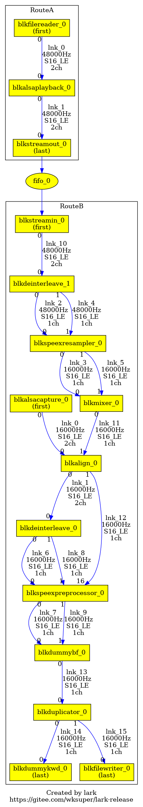

# lark

[English](https://gitee.com/wksuper/lark-release/blob/master/README.md) | [简体中文](https://gitee.com/wksuper/lark-release/blob/master/README-cn.md)

***lark*** is a lite but powerful software audio DSP. It provides a flexible and scalable way to design audio route(s) with high performance, low MCPS and low latency that allows you to build your audio system like building blocks.
Main features (as of v0.10):

- Support realtime manipulating audio routes
  - Load/Unload blocks in real time
  - Change routes in real time
  - Tune block parameters in real time
- Support prebuilt I/O blocks
  - file-reader, file-writer, stream-in, stream-out, alsa-capture, alsa-playback, tinyalsa-capture, tinyalsa-playback, portaudio-capture, portaudio-playback
- Support prebuilt algorithm blocks
  - gain, mixer, duplicator, multiplexer, interleave, de-interleave, format-adapter, delay, align, buffer, speex-resampler, speex-preprocessor, soundtouch, sox-effect
- Support customizing blocks extensively
- Support up-to 32 input endpoints and 32 output endpoints for each block
- Support timestamp for each frame / each sample
- Support realtime debug tool
  - Print status
  - Print routes snapshot to a file
  - Change log level
  - Dump log to a file
  - Dump each block's audio data to files
- Support for multiple operating systems
  - Linux (x86_64), MacOS (x86_64), Android (aarch64)

## Get Started

***lark*** is composed by a basic shared library `liblark.so`, various optional blocks(dynamic load libraries) e.g. `libblkmixer.so`, and an optional executable debug utility `lkdb`. Based on ***lark***, you can easily create either simple or complex audio route(s) as you want, start/stop any route in realtime, or set/get parameters to/from any block in realtime.

### Step 1

Since ***lark*** depends on the klogging library, you should install klogging at first. Go to <https://gitee.com/wksuper/klogging> to get klogging installed. Alternatively the prebuilt `libklogging.so` is also available in this repo. It will be installed along with lark installation.

### Step 2

Install ***lark*** on your Linux machine.

```bash
$ cd lark-release
$ sudo ./install.sh
$ sudo ldconfig
```

You can use `sudo ./uninstall.sh` to remove ***lark*** when you don't need it.

### Step 3

Run audio route(s).

#### Example 1: Run a single route for stereo music file playback

```
RouteA

  libblkfilereader.so     libblkalsaplayback.so
  *******************      ******************
  *                 *      *                *
  *  filereader_0   *0--->0* alsaplayback_0 *
  *                 *      *                *
  *******************      ******************
```

```bash
$ x86_64-linux-gnu/bin/larkexample1
```

If no error, the music file should be started to play.

The source code of this example is shown in [larkexample1.cpp](https://gitee.com/wksuper/lark-release/blob/master/examples/larkexample1.cpp).

#### Example 2: Run a single route for music playback where two files input are mixed with separate gain

```
RouteA

 libblkfilereader.so   libblkdeinterleave.so   libblkgain.so           libblkmixer.so       libblkinterleave.so     libblkalsaplayback.so

  *****************     ******************     *************           **************       *******************      ******************
  *               *     *                *0-->0*           *0-------->0*            *0---->0*                 *      *                *
  * filereader_0  *0-->0* deinterleave_0 *1-->1*   gain_0  *1---+      *   mixer_0  *       *   interleave_0  *0--->0* alsaplayback_0 *
  *               *     *                *     *           *    | +-->1*            *   +->1*                 *      *                *
  *****************     ******************     *************    | |    **************   |   *******************      ******************
                                                                | |                     |
  *****************     ******************     *************    | |    **************   |
  *               *     *                *     *           *    +-|-->0*            *0--+
  * filereader_1  *0-->0* deinterleave_0 *0-->0*   gain_1  *0-----+    *   mixer_1  *
  *               *     *                *1-->1*           *1-------->1*            *
  *****************     ******************     *************           **************
```

```bash
$ x86_64-linux-gnu/bin/larkexample2
```

If no error, the two files mixed music should be started to play.

The source code of this example is shown in [larkexample2.cpp](https://gitee.com/wksuper/lark-release/blob/master/examples/larkexample2.cpp).

#### Example 3: Run dual routes, one for music playback, one for microphone capture with keyword detection

```
                                                                                                     ****************      ******************      ***************
                                                                                        RouteA       *              *      *                *      *             *
                                                                                                     * filereader_0 *0--->0* alsaplayback_0 *0--->0* streamout_0 *
                                                                                                     *              *      *                *      *             *
                                                                                                     ****************      ******************      ********|******
                                                                                                                                                           v
========================================================================================================================================================[FIFO]=====
                                                                                                                                                         |
  **************     **************     *************     ***********************     ******************     ***********     *****************      *****v********
  *            *     *            *     *           *     *                     *     *                *     *         *     *               *      *            *
  * dummykwd_0 *0<--0*            *     *           *     *                     *0<--0* deinterleave_0 *0<--0*         *0<--0* alsacapture_0 *      * streamin_0 *
  *            *     *            *     *           *     *                     *1<--1*                *     *         *     *               *      *            *
  **************     *            *     *           *     *                     *     ******************     *         *     *****************      ******0*******
                     *            *     *           *     *                     *                            *         *                                  v
                     *  mixer_1   *0<--0* dummybf_0 *0<--0* speexpreprocessor_0 *                            * align_0 *                        **********0*******
                     *(duplicator)*     *           *1<--1* (aec, denoise, ...) *                            *         *          RouteB        * deinterleave_1 *
                     *            *     *           *     *                     *                            *         *                        ********0**1******
                     *            *     *           *     *                     *                            *         *                                v  v
****************     *            *     *           *     *                     *                            *         *     ***********      **********0**1******
*              *     *            *     *           *     *                     *16<------------------------1*         *     *         *0<---0*                  *
* filewriter_0 *0<--1*            *     *           *     *                     *                            *         *1<--0* mixer_0 *1<---1* speexresampler_0 *
*              *     *            *     *           *     *                     *                            *         *     *         *      *                  *
****************     **************     *************     ***********************                            ***********     ***********      ********************
```

To run example3, the speex libaray is needed first.

```bash
$ sudo apt install libspeexdsp-dev
```

Run example3:

```bash
# The two arguments are the alsa playback pcm name and capture pcm name.
# They vary machine by machine.
$ x86_64-linux-gnu/bin/larkexample3 plughw:0,0 plughw:0,0
```

If no error, playback and capture will be started.
The captured audio is saved in `./cap-16000_16_1.pcm`.

The source code of this example is shown in [larkexample3.cpp](https://gitee.com/wksuper/lark-release/blob/master/examples/larkexample3.cpp).

#### Example 5: Run a single playback route with SoundTouch embedded for tuning sound pitch, tempo and rate

```
RouteA

 libblkfilereader.so   libblkformatdapter.so    libblksoundtouch.so   libblkpaplayback.so
  ****************      *******************      ****************      ****************
  *              *      *                 *      *              *      *              *
  * filereader_0 *0--->0* formatadapter_0 *0--->0* soundtouch_0 *0--->0* paplayback_0 *
  *              *      *                 *      *              *      *              *
  ****************      *******************      ****************      ****************
```

To run example5, the ***SoundTouch*** library and the ***PortAudio*** library are needed first.

```bash
$ sudo apt install libsoundtouch-dev
$ sudo apt install libportaudio2
```

Run example5:

```bash
$ x86_64-linux-gnu/bin/larkexample5
```

If no error, playback will be started.

In the other shell,

```bash
$ lkdb status                                   # Shows lark status

$ lkdb setparam RouteA blksoundtouch_0 1 0.6    # Sound pitch goes lower
$ lkdb setparam RouteA blksoundtouch_0 1 1.8    # Sound pitch goes higher
$ lkdb setparam RouteA blksoundtouch_0 1 1.0    # Sound pitch goes normal
$ lkdb setparam RouteA blksoundtouch_0 2 0.5    # Sound tempo goes slower
$ lkdb setparam RouteA blksoundtouch_0 2 2.0    # Sound tempo goes faster
$ lkdb setparam RouteA blksoundtouch_0 2 1.0    # Sound tempo goes normal
$ lkdb setparam RouteA blksoundtouch_0 3 2.2    # Sound rate goes faster
$ lkdb setparam RouteA blksoundtouch_0 3 0.4    # Sound rate goes slower
$ lkdb setparam RouteA blksoundtouch_0 3 1.0    # Sound rate goes normal
```

The source code of this example is shown in [larkexample5.cpp](https://gitee.com/wksuper/lark-release/blob/master/examples/larkexample5.cpp).

#### Example 7: Run a single playback route with SoX effects

```
RouteA

 libblkfilereader.so  libblkformatdapter.so   libblkdeinterleave.so  libblkmixer.so  libblksoxeffect.so  libblkinterleave.so  libblkpaplayback.so

  ****************     *******************     ******************     ***********     ***************     ****************     ****************
  *              *     *                 *     *                *     *         *     * soxeffect_0 *     *              *     *              *
  *              *     *                 *     *                *0-->0*         *0-->0* (highpass)  *0-->0*              *     *              *
  *              *     *                 *     *                *     *         *     ***************     *              *     *              *
  * filereader_0 *0-->0* formatadapter_0 *0-->0* deinterleave_0 *     * mixer_0 *                         * interleave_0 *0-->0* paplayback_0 *
  *              *     *                 *     *                *     *         *     ***************     *              *     *              *
  *              *     *                 *     *                *1-->1*         *0-->0* soxeffect_1 *0-->1*              *     *              *
  *              *     *                 *     *                *     *         *     *  (lowpass)  *     *              *     *              *
  ****************     *******************     ******************     ***********     ***************     ****************     ****************
```

To run example7, the ***SoX*** library and the ***PortAudio*** library are needed first.

```bash
$ sudo apt install libsox-dev
$ sudo apt install libportaudio2
```

Run example5:

```bash
$ x86_64-linux-gnu/bin/larkexample7
```

If no error, playback will be started.

In the other shell,

```bash
$ lkdb status                                  # Shows lark status

$ lkdb setparam RouteA blksoxeffect_0 0 400    # Only higher than 400Hz music signals go to left speaker
$ lkdb setparam RouteA blksoxeffect_1 0 400    # Only lower than 400Hz music signals go to right speaker
```

The source code of this example is shown in [larkexample7.cpp](https://gitee.com/wksuper/lark-release/blob/master/examples/larkexample7.cpp).

#### Furthermore Examples

[Author's blog: <My Engineer Daddy - Audio Application DIY Series>](https://blog.csdn.net/weixin_44278307?type=blog) demonstrated by using ***lark*** how to deal with the daily audio related affairs of life through a series of short stories.

## Debug with `lkdb` in Realtime

When ***lark*** is running in a process, the debug utility `lkdb` can communicate with it to get info from ***lark*** and send command to ***lark***.

```
Usage:
  lkdb status
    - Print the lark running status
    - Print dot code if enabled '--dot' option
  lkdb newroute ROUTENAME
    - Create a named route
  lkdb newblock ROUTENAME SOLIB ISFIRST ISLAST [ARGS]
    - Create a block on the route from the dynamic load library
  lkdb newlink ROUTENAME RATE FORMAT CHNUM FRAMESIZEINSAMPLES SRCBLKNAME SRCBLKOUTEPIDX SINKBLKNAME SINKBLKINEPIDX
    - Create a link to link the source block and sink block on the route
  lkdb start ROUTENAME
    - Start the route
  lkdb stop ROUTENAME
    - Stop the route
  lkdb setparam ROUTENAME BLOCKNAME PARAMID [PARAMS]
    - Set parameter to the block in the route
  lkdb getparam ROUTENAME BLOCKNAME PARAMID
    - Get parameter from the block in the route
  lkdb delete ROUTENAME LINKNAME
    - Delete the link from the route
  lkdb delete ROUTENAME BLOCKNAME
    - Delete the block and associated link(s) from the route
  lkdb delete ROUTENAME !
    - Delete the entire route
  lkdb loglevel LEVEL
    - Set the logging LEVEL: 0=off 1=fatal 2=error 3=warning 4=info(default) 5=debug 6=verbose
  lkdb setdump DIRECTORY
    - Enable dumping log & data when DIRECTORY is a valid path
    - Disable dumping log & data when DIRECTORY is --
```

For example, when running example2, in the other shell, you can tune example2's volume gains via `lkdb`.

```bash
$ lkdb status                               # Shows lark status
RouteA is RUNNING, 625 frames processed OK, 0 error frame
	blkfilereader_0
		(O00) --> lnk_0    48000Hz   S16_LE  2ch    960samples/frame
	blkdeinterleave_0
		(I00) <-- lnk_0    48000Hz   S16_LE  2ch    960samples/frame
		(O00) --> lnk_1    48000Hz   S16_LE  1ch    960samples/frame
		(O01) --> lnk_2    48000Hz   S16_LE  1ch    960samples/frame
	blkfilereader_1
		(O00) --> lnk_3    48000Hz   S16_LE  2ch    960samples/frame
	blkdeinterleave_1
		(I01) <-- lnk_3    48000Hz   S16_LE  2ch    960samples/frame
		(O00) --> lnk_4    48000Hz   S16_LE  1ch    960samples/frame
		(O01) --> lnk_5    48000Hz   S16_LE  1ch    960samples/frame
	blkgain_0
		(I00) <-- lnk_1    48000Hz   S16_LE  1ch    960samples/frame
		(I01) <-- lnk_2    48000Hz   S16_LE  1ch    960samples/frame
		(O00) --> lnk_6    48000Hz   S16_LE  1ch    960samples/frame
		(O01) --> lnk_7    48000Hz   S16_LE  1ch    960samples/frame
	blkgain_1
		(I00) <-- lnk_4    48000Hz   S16_LE  1ch    960samples/frame
		(I01) <-- lnk_5    48000Hz   S16_LE  1ch    960samples/frame
		(O00) --> lnk_8    48000Hz   S16_LE  1ch    960samples/frame
		(O01) --> lnk_9    48000Hz   S16_LE  1ch    960samples/frame
	blkmixer_0
		(I00) <-- lnk_6    48000Hz   S16_LE  1ch    960samples/frame
		(I01) <-- lnk_8    48000Hz   S16_LE  1ch    960samples/frame
		(O00) --> lnk_10   48000Hz   S16_LE  1ch    960samples/frame
	blkmixer_1
		(I00) <-- lnk_7    48000Hz   S16_LE  1ch    960samples/frame
		(I01) <-- lnk_9    48000Hz   S16_LE  1ch    960samples/frame
		(O00) --> lnk_11   48000Hz   S16_LE  1ch    960samples/frame
	blkinterleave_0
		(I00) <-- lnk_10   48000Hz   S16_LE  1ch    960samples/frame
		(I01) <-- lnk_11   48000Hz   S16_LE  1ch    960samples/frame
		(O00) --> lnk_12   48000Hz   S16_LE  2ch    960samples/frame
	blkalsaplayback_0
		(I00) <-- lnk_12   48000Hz   S16_LE  2ch    960samples/frame
```

```bash
$ lkdb setparam RouteA blkgain_0 1 0 0.5    # Output volume of kanr-48000_16_2.pcm left channel should be lower
$ lkdb setparam RouteA blkgain_0 1 1 0.5    # Output volume of kanr-48000_16_2.pcm right channel should be lower
$ lkdb setparam RouteA blkgain_0 1 0 0.0    # Output volume of kanr-48000_16_2.pcm left channel should be muted
$ lkdb setparam RouteA blkgain_0 1 1 0.0    # Output volume of kanr-48000_16_2.pcm right channel should be muted

$ lkdb setparam RouteA blkgain_1 1 0 0.5    # Output volume of pacificrim-48000_16_2.pcm left channel should be lower
$ lkdb setparam RouteA blkgain_1 1 1 0.5    # Output volume of pacificrim-48000_16_2.pcm right channel should be lower
$ lkdb setparam RouteA blkgain_1 1 0 0.0    # Output volume of pacificrim-48000_16_2.pcm left channel should be muted
$ lkdb setparam RouteA blkgain_1 1 1 0.0    # Output volume of pacificrim-48000_16_2.pcm right channel should be muted

$ lkdb setparam RouteA blkgain_0 1 0 1.0    # Output volume of kanr-48000_16_2.pcm left channel should be recovered back
$ lkdb setparam RouteA blkgain_0 1 1 1.0    # Output volume of kanr-48000_16_2.pcm right channel should be recovered back

$ lkdb setparam RouteA blkgain_1 1 0 1.0    # Output volume of pacificrim-48000_16_2.pcm left channel should be recovered back
$ lkdb setparam RouteA blkgain_1 1 1 1.0    # Output volume of pacificrim-48000_16_2.pcm right channel should be recovered back
```

For another example, when running example3, in the other shell, you can take a snapshot of the routes via `lkdb`.

```bash
$ lkdb status --dot | dot -Tpng -o larkexample3.png
```

The routes snapshot will be saved to `larkexample3.png`.



Note: This requires graphviz(dot) to be installed on your machine.

```bash
$ sudo apt install graphviz
```

## Make Your Own Audio Route(s)

### Step 1

Design the route(s) in your mind. The prebuilt blocks(like gain, mixer, etc.) can be used directly. If you need custom block(s), you can compile the so library file(s) by yourself. [BlkPassthrough.cpp](https://gitee.com/wksuper/lark-release/blob/master/examples/BlkPassthrough.cpp) is an example of block source code. See [MANUAL.md - 4 Build Your Own Block](https://gitee.com/wksuper/lark-release/blob/master/MANUAL.md#4-build-your-own-block) for more detail.

### Step 2

For test(try run) only purpose, `lkdb` is qualified to do that.

For example, to run the same route as example1's, you can also use `lkdb` to create route, start/stop route, delete route.

In one shell,

```bash
$ x86_64-linux-gnu/bin/larkexample0    # Run lark
```

In the other shell,

```bash
$ lkdb newroute RouteA
Created RouteA
$ lkdb newblock RouteA libblkfilereader.so true false examples/kanr-48000_16_2.pcm
Created blkfilereader_0 from libblkfilereader.so on RouteA
$ lkdb newblock RouteA libblkalsaplayback.so false true
Created blkalsaplayback_0 from libblkalsaplayback.so on RouteA
$ lkdb newlink RouteA 48000 S16_LE 2 960 blkfilereader_0 0 blkalsaplayback_0 0
Created lnk_0 on RouteA
$ lkdb start RouteA      # The music playback should be started
Started RouteA
$ lkdb stop RouteA
Stopped RouteA
$ lkdb delete RouteA !
Deleted RouteA
```

The source code of this example is shown in [larkexample0.cpp](https://gitee.com/wksuper/lark-release/blob/master/examples/larkexample0.cpp).

### Step 3

For applying on real product, you need to call ***lark*** APIs to make your own audio route(s) in your process. [Examples](https://gitee.com/wksuper/lark-release/tree/master/examples) have been listed. Refer to [User Manual](https://gitee.com/wksuper/lark-release/blob/master/MANUAL.md) for detail.

## FAQs

**Q1**: What is "block"? What is "endpoint"? What is "link"? What is "route"?

**A**: A "block" is a software DSP processor unit. It is created from a dynamic load so library and managed by ***lark*** route. It accepts up-to 32 inputs(called input endpoints) data, processes them, and fills the processed data into the output endpoints (up-to 32 outputs). Usually, one endpoint represents one audio channel. However, one endpoint can also carry multi-channels. e.g. The output endpoint of "interleave" block would carry multi-channels. A "link" links an output endpoint of a block as the source to an input endpoint of the other block as the sink. A "route" is a blocks-linked chain(or graph).

**Q2**: On one machine, how many ***lark***s can I run? Within one ***lark***, how many routes can I create? Within one route, how many blocks can I create? How many first blocks and last blocks can I create?

**A**: On one machine, only one process is allowed to create the ***lark***. i.e. One machine runs one ***lark***. `lkdb` will communicate with the unique ***lark***. Within one ***lark***, 26 routes can be created at maximum, with the name "RouteA", "RouteB", ..., "RouteZ" specified manually. For each route, name is required and should be fixed to "Route#"(case sensitive) where "#" stands for [A-Z]. Within one route, no amount limitation to create the blocks. All the blocks/links created from a route belong to this route, which means their resources are managed by this route. Also, no amount limitation to create first blocks and last blocks.

**Q3**: What is "first block"? What is "last block"?

**A**: In one route, at least one "first block" and one "last block" have to be created with the "first" flag and the "last" flag specified separately. So that, the route can know from which block(s) to begin processing and from which block(s) to end processing. From the first block(s) to the last block(s), blocks should be linked without cut-off. The route can only start to run when the links are complete. If there is cut-off in the route, it is allowed, but the route won't be able to run. If you insist to run, the route will stay in BROKEN_RUNNING state until the cut-off is linked up.

**Q4**: What's the difference between "multi-routes" and "multi-first-blocks in one route"? If I have multiple inputs as the first blocks, how to select between "multi-routes" and "multi-first-blocks in one route"?

**A**: One route has one thread to process data. Normally "multi-first-blocks in one route" can work well. In this case, the multiple inputs are able to provide frames at the same pace, and they shouldn't be blocked by each other. For example, one input is alsacapture, one input is filereader. The scenario that needs multi-routes is, if the multiple inputs running in one route have chance to block each other, then they need to be separated into multi-routes. For example, one input is alsacapture, one input is echo-reference.

## Change Log

### 0.10

- Supported `BlkDuplicator` block to duplicate an endpoint with arbitrary channel number(mono or multi-channels).
- Adapted for klogging v1.1.3

### 0.9

- Route: Supported a group of actions for NewBlock() NewLink()
- Supported aarch64-android

### 0.8

- BlkSoxEffect: Supported interleaved channels
- Route: Fixed unable to start when BROKEN_RUNNING
- larkexample4: Applied sox oops effect
- BlkMixer: Fixed float mixing overflow
- Block: Supported subname
- Supported BlkMultiplexer

### 0.7.2

- lkdb: Fixed `lkdb status --dot` when multiple routes are presenting
- Supported FIFO name
- lkdb: `lkdb status --dot` is able to draw the FIFO connection between routes
- BlkDelay: Supported default delay value

### 0.7.1

- lkdb: Fixed 'lkdb status --dot' last block name label error

### 0.7

- lkdb: Added `lkdb status --dot` that can output dot code by which the routes graphic snapshot can be drawed
- Adapted for klogging v1.1.2

### 0.6

- Added BlkSoxEffect: vol, flanger, tremolo, echos, chorus, equalizer, highpass, lowpass, etc.
- Added larkexample7: a simple SoX HPF/LPF application
- Adapted for klogging v1.1

### 0.5

- Fixed invalid dumpFileName when data dump
- Supported log dump
- Supported conf file
  - Refer to [MANUAL.md - 6 Configuration File](https://gitee.com/wksuper/lark-release/blob/master/MANUAL.md#6-configuration-file) for detail.

### 0.4

- lkdb: Better readable parameters
- BlkFileReader BlkFileWriter: Remove arguments when creation
- BlkAlsaPlayback BlkAlsaCapture: Support pcm name when creation
- Rename block functions for readability
- Adapt for klogging v0.9

### 0.3

- Supported more blocks
  - BlkTinyAlsaPlayback BlkTinyAlsaCapture BlkFormatAdapter BlkPACapture
- Added larkexample6
  - This example is able to play to microphone sound with pitch tunning in real time by running two routes.
  - RouteB(BlkPACapture->BlkMixer->BlkInterleave->BlkStreamOut)->FIFO->RouteA(BlkStreamIn->BlkDelay->BlkFormatAdapter->BlkSoundTouch->BlkPAPlayback)

### 0.2

- Supported MacOS (x86_64)
  - `x86_64-apple-darwin/bin/larkexample4` and `x86_64-apple-darwin/bin/larkexample5` are able to run
- Splited `README.md` into [README.md](https://gitee.com/wksuper/lark-release/blob/master/README.md)(English) and [README-cn.md](https://gitee.com/wksuper/lark-release/blob/master/README-cn.md)(simplified Chinese)

### 0.1

- Support realtime manipulating audio routes
  - Load/Unload blocks in real time
  - Change routes in real time
  - Tune block parameters in real time
  - Set log level in real time
  - Dump data of each block in real time
- Support prebuilt I/O blocks
  - file-reader, file-writer, stream-in, stream-out, alsa-capture, alsa-playback, portaudio-playback
- Support prebuilt algorithm blocks
  - gain, mixer(duplicator), interleave, de-interleave, format-adapter, delay, align, buffer, speex-resampler, speex-preprocessor, soundtouch
- Support customizing blocks extensively
- Support up-to 32 input endpoints and 32 output endpoints for each block
- Support timestamp for each frame / each sample
- Support realtime debug tool
- Support for multiple operating systems
  - Linux (x86_64) currently
